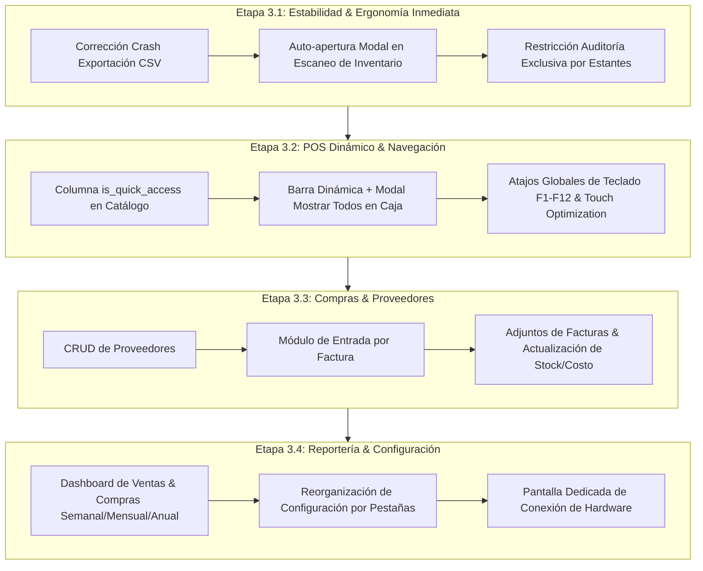

# iLuz POS & Inventario - Especificación y Hoja de Ruta Fase 3
**Versión:** 3.0  
**Fecha:** 29 de Septiembre de 2026  
**Estado:** Requerimientos Aprobados / Pendiente de Implementación  
**Pila Tecnológica:** Go 1.22 + Wails v2 + modernc.org/sqlite + React 18 + Vite

---

## 1. Resumen Ejecutivo y Objetivos

Este documento formaliza la totalidad de los nuevos requerimientos, correcciones críticas y mejoras operativas para la aplicación **iLuz (Tienda POS)**. Su propósito es servir como la **especificación técnica y hoja de ruta de implementación** para transformar el sistema en una solución integral de inventario, punto de venta táctil, gestión de compras y proveedores, y reportería financiera adaptada a la realidad del comercio de barrio en Colombia.

---

## 2. Matriz de Requerimientos y Mejoras

| ID | Módulo / Área | Tipo | Descripción Sintética | Prioridad |
| :--- | :--- | :--- | :--- | :--- |
| **REQ-01** | Inventario | Mejora UX | Al escanear un producto existente en la pestaña Inventario, abrir automáticamente su modal de edición. | Alta |
| **REQ-02** | Auditoría Física | Bugfix Crítico | Solucionar el bloqueo/cierre inesperado (*crash*) al exportar el archivo CSV de toma de inventario. | Crítica |
| **REQ-03** | Auditoría Física | Regla de Negocio | Restringir el alcance de la toma de inventario exclusivamente por Estantería(s) completas o Toda la Tienda (sin niveles/casillas). | Alta |
| **REQ-04** | Caja / POS | Funcionalidad | Productos de acceso rápido configurables en el catálogo (`is_quick_access`) con visualizador "Mostrar todos". | Alta |
| **REQ-05** | Proveedores | Nuevo Módulo | Módulo y vista CRUD para gestión completa de Proveedores (NIT, nombre, contacto, plazos). | Media-Alta |
| **REQ-06** | Compras / Entradas | Nuevo Módulo | Modo activo de entrada de mercancía por pedido/factura de proveedor con escaneo continuo y adjuntos. | Alta |
| **REQ-07** | Reportería | Nuevo Módulo | Panel de reportes de ventas y compras (semanales, mensuales y anuales) con balance de margen. | Alta |
| **REQ-08** | Navegación / Atajos | Accesibilidad | Navegación completa por teclado (teclas rápidas F1–F12, Esc, Enter) y soporte manual. | Media-Alta |
| **REQ-09** | Diseño & Táctil | Ergonomía | Escalar tamaño de fuentes, íconos y áreas de toque (mínimo 44–48px) para pantallas táctiles. | Alta |
| **REQ-10** | Cabecera / Módulos | Navegación | Barra de navegación con scroll horizontal mostrando 4 módulos principales visibles a la vez. | Media |
| **REQ-11** | Hardware / Lector | UX / Conectividad | Trasladar indicadores de conexión del escáner a una vista/modal dedicada de hardware. | Media |
| **REQ-12** | Configuración | UX / Organización | Rediseñar la vista de configuración en secciones/pestañas temáticas estructuradas. | Media |

---

## 3. Especificación Detallada por Módulo

### Módulo 1: Inventario - Auto-Apertura de Edición al Escanear (REQ-01)
* **Comportamiento Actual:** En la pestaña `Inventario`, al escanear un producto existente, solo se emite un `Toast` informativo indicando *"Producto encontrado"*, requiriendo buscar manualmente la fila y hacer clic en el botón de lápiz.
* **Comportamiento Requerido:** 
  1. Al recibir un escaneo en `currentTab === 'inventory'`:
     - Si el producto **existe**: Abrir inmediatamente el `ProductModal` con todos los datos cargados para permitir edición rápida (ajuste de precio, costo, stock o posición física).
     - Si el producto **no existe**: Mantener el flujo actual de abrir el `ProductModal` en modo creación con el código de barras prellenado.
  2. Al cerrar el modal (guardar o cancelar con <kbd>Esc</kbd>), el foco regresa a la ventana principal para seguir escaneando.

---

### Módulo 2: Auditoría de Inventario - Corrección de Crash en CSV y Filtro por Estantes (REQ-02, REQ-03)

#### A. Diagnóstico y Corrección del Crash en Exportación CSV (REQ-02)
* **Causa Raíz Identificada:**
  1. Al presionar *"Finalizar y Exportar"*, la sesión pasa a estado cerrado y `activeAuditSession` se establece en `null` en el frontend, enviando un `sessionId` nulo o `0` a la base de datos, lo que dispara un error SQL no controlado.
  2. En el backend de Go (`app.go`), la llamada a `runtime.SaveFileDialog(a.ctx, ...)` en Windows 10/11 sin inicialización de hilo COM bloquea el bucle de eventos del WebView2 o falla nativamente si el diálogo pierde el foco del HWND padre.
* **Solución de Arquitectura:**
  1. Mantener en memoria el `lastCompletedSessionId` tras el cierre de auditoría para asegurar que el ID siempre viaje correctamente.
  2. En Go, proteger `ExportInventorySessionCSVFile` con `defer/recover` y ejecutar el guardado en directorio seguro por defecto (ej. carpeta `Documentos/iLuz_Reportes/`) o abrir el diálogo nativo encapsulado en hilo principal.
  3. Fortalecer el fallback en frontend mediante generación de `Blob` directo con descarga inmediata por enlace temporal `a.download`, garantizando cero caídas del binario.

#### B. Restricción Exclusiva por Estanterías (REQ-03)
* **Regla de Negocio:** La toma de inventario solo podrá realizarse bajo dos modalidades:
  1. **Toda la Tienda:** Toma general de todos los productos activos.
  2. **Por Estantería(s):** Selección de una o varias estanterías completas (ej. `[x] EST01 - Estante Central`, `[x] NEV01 - Nevera Lácteos`). No se permitirá seleccionar niveles o casillas individuales (`N1-C1`).
* **Implementación:**
  - En `StartAuditModal.jsx`, reemplazar el selector plano de ubicaciones por un listado de checkboxes de `shelves`.
  - La consulta en backend filtrará productos cuyo campo `location` comience por cualquiera de los códigos de las estanterías seleccionadas (`location LIKE 'EST01%' OR location LIKE 'EST02%'`).

---

### Módulo 3: Productos de Acceso Rápido Dinámicos (REQ-04)

* **Problema:** En `POSView.jsx`, los productos rápidos estaban fijos en código fuente (`Pan`, `Huevo`, `Bombón`, `Cilantro`, `Gaseosa`).
* **Comportamiento Requerido:**
  1. **En Base de Datos y Catálogo:**
     - Agregar columna `is_quick_access BOOLEAN DEFAULT 0` a la tabla `products`.
     - En `ProductModal.jsx`, añadir la casilla:  
       `☑ Producto de Acceso Rápido (Mostrar botón directo en Caja)`
  2. **En la Vista de Caja (`POSView.jsx`):**
     - La barra superior de productos rápidos consultará dinámicamente los productos marcados con `is_quick_access = 1`.
     - Se mostrarán los primeros $N$ botones (los que quepan cómodamente en una fila sin romper la interfaz).
     - Si hay más productos configurados que los visibles, aparecerá un botón destacado:  
       `[➕ Ver todos (X productos)]`
     - Al presionar este botón, se desplegará una modal o rejilla táctil con todos los productos rápidos organizados en tarjetas grandes con precio, stock y nombre, permitiendo sumarlos al carrito con un solo toque.

---

### Módulo 4: Módulo de Proveedores (REQ-05)

* **Objetivo:** Registrar y administrar las distribuidoras, mayoristas y proveedores de mercancía (Bavaria, Postobón, Colanta, mayoristas de víveres, etc.).
* **Estructura de Datos (`suppliers`):**
  - `id`: Entero autoincremental.
  - `nit_or_cedula`: Documento o NIT con dígito de verificación.
  - `name`: Razón social o nombre comercial del proveedor (requerido).
  - `contact_name`: Nombre del vendedor o asesor comercial.
  - `phone`: Teléfono o celular (con botón directo de llamada / WhatsApp).
  - `email`: Correo para pedidos o recepción de facturas.
  - `address`: Dirección física o bodega.
  - `payment_terms`: Condiciones comerciales (`Contado`, `Crédito 8 días`, `Crédito 15 días`, `Crédito 30 días`).
  - `delivery_days`: Días habituales de visita/entrega (Lunes, Jueves, etc.).
  - `notes`: Observaciones sobre el proveedor.
  - `active`: Booleano (activo / inactivo).
* **Vistas:**
  - Pestaña / Vista `SuppliersView.jsx`: Tabla con buscador en tiempo real, filtro activo/inactivo, botón de nuevo proveedor y acciones de edición.
  - Modal `SupplierModal.jsx`: Formulario limpio con validación.

---

### Módulo 5: Entrada a Inventario por Pedido / Compra de Mercancía (REQ-06)

* **Concepto Operativo:** Cuando el camión repartidor o vendedor entrega el pedido en la tienda, el tendero abre una **Sesión de Entrada de Pedido**. A medida que desembala las cajas, va pistoleando cada producto; el sistema va sumando cantidades a esa factura y cargándolas al inventario.
* **Flujo Operativo Paso a Paso:**
  1. **Inicio de Entrada:**
     - El usuario hace clic en *"Nueva Entrada de Mercancía"*.
     - Selecciona el **Proveedor** (del catálogo de proveedores).
     - Digita el **Número de Factura / Remisión** y la **Fecha de Factura**.
     - Selecciona la **Forma de Pago** (Contado de caja o Factura a crédito por pagar).
     - **Adjuntar Factura:** Opción para adjuntar foto tomada con la cámara, imagen escaneada o archivo PDF de la factura física. Se guarda de forma local en la carpeta de datos de la tienda.
  2. **Sesión Activa de Escaneo de Mercancía:**
     - La pantalla entra en modo *"Ingresando Factura: [Proveedor] - #[Factura]"*.
     - Cada producto escaneado:
       - Si ya existe en catálogo: Se agrega una fila en la factura. Cada pistoleo incrementa la cantidad en +1 (o permite editar cantidad en bloque, ej. 24 cervezas).
       - Permite validar o cambiar el **Costo Unitario** de compra. Si el costo subió, el sistema alerta y sugiere actualizar el **Precio de Venta** para no perder margen.
       - Si el código no está en el catálogo: Despliega el formulario de registro rápido para crearlo de inmediato e incluirlo en la compra.
  3. **Finalización y Registro Transaccional:**
     - Al presionar *"Finalizar e Ingresar a Inventario"*:
       - Se ejecuta una transacción SQLite atómica.
       - Se incrementa el `stock` de cada producto en la cantidad ingresada.
       - Se actualiza el `cost_price` en el catálogo con el nuevo costo de compra.
       - Se insertan los registros en `stock_movements` con razón `'purchase'` y referencia al ID de la compra.
       - Se guarda el registro en `purchases` y `purchase_items` con el total liquidado y la ruta del adjunto.

---

### Módulo 6: Sistema de Reportería Financiera y Comercial (REQ-07)

* **Objetivo:** Proveer visibilidad clara, visual y exportable de la salud del negocio, cumpliendo además con los límites fiscales de la DIAN para personas naturales no responsables de IVA (< 3.500 UVT/año).
* **Métricas Principales:**
  1. **Ventas:**
     - Ventas Semanales (Lunes a Domingo con comparativa de días de mayor tráfico).
     - Ventas Mensuales (Mes actual vs. mes anterior).
     - Ventas Anuales (Acumulado anual en pesos y porcentaje respecto al tope de 3.500 UVT).
     - Desglose por método de pago: Efectivo en gaveta, Transferencias (Nequi/Daviplata/Bancolombia) y Créditos otorgados (*Fiao*).
  2. **Compras a Proveedores:**
     - Compras Semanales, Mensuales y Anuales.
     - Top proveedores a los que más se les compra en volumen de dinero.
  3. **Rentabilidad y Márgenes:**
     - Margen Bruto Estimado = $\text{Total Ventas} - \text{Costo de Mercancía Vendida}$.
     - Ranking de los 10 productos más vendidos y los 10 más rentables.
  4. **Exportación:** Botón para generar reporte en Excel/CSV o formato imprimible en tiquete de 80mm para el balance del día/mes.

---

### Módulo 7: Ergonomía Visual, Pantallas Táctiles y Hardware (REQ-08 al REQ-12)

#### A. Atajos de Teclado y Navegación Manual (REQ-08)
* <kbd>F1</kbd>: Ir a **Caja / Punto de Venta**.
* <kbd>F2</kbd>: Ir a **Inventario**.
* <kbd>F3</kbd>: Ir a **Locaciones / Estantes**.
* <kbd>F4</kbd>: Ir a **Entradas / Compras**.
* <kbd>F5</kbd>: Ir a **Proveedores**.
* <kbd>F6</kbd>: Ir a **Reportes**.
* <kbd>F12</kbd>: Disparar **Cobrar** (en la vista de caja si el carrito tiene ítems).
* <kbd>Esc</kbd>: Cancelar modal activo / Limpiar vista de producto escaneado.

#### B. Escalamiento de Tipografía, Íconos y Objetivos Táctiles (REQ-09)
* **Tamaños Táctiles:** Todos los botones interactivos tendrán una altura mínima de **46px a 50px** con `touch-action: manipulation` para evitar demoras por doble toque en pantallas táctiles de Windows.
* **Tipografía:** Aumentar el tamaño base de lectura de 13px a **15px/16px**, con números de precios y totales en fuentes grandes de alto contraste (**20px a 28px**).
* **Espaciado en Tablas:** Incrementar el padding de las celdas de las tablas de 6px a **12px** para evitar toques accidentales en filas contiguas.

#### C. Menú de Suites / Módulos con Scroll Horizontal (REQ-10)
* En pantallas medianas o reducidas, la barra superior mantendrá visibles los primeros 4 módulos prioritarios:
  1. 🛒 **Caja**
  2. 📦 **Inventario**
  3. 📍 **Locaciones**
  4. 📥 **Entradas / Compras**
* Los módulos restantes (**Proveedores**, **Reportes**, **Hardware**) serán accesibles mediante scroll horizontal suave o menú desplegable de opciones adicionales.

#### D. Pantalla / Modal Dedicada de Hardware y Conectividad (REQ-11)
* Mover el selector de puerto COM (`COM3`, etc.), baudrate y estado del escáner fuera de la barra superior.
* Crear una vista/modal de **Conectividad y Dispositivos** donde se pueda:
  - Ver el estado del lector (Conectado / Desconectado).
  - Probar lectura de prueba en pantalla.
  - Escanear puertos disponibles y reconectar sin reiniciar el programa.
  - Configurar impresora térmica de tiquetes.

#### E. Rediseño Estructurado de Configuración (REQ-12)
* Reorganizar `SettingsModal.jsx` en pestañas verticales u horizontales:
  1. **Datos de la Tienda:** Nombre comercial, propietario, NIT/Cédula, dirección, teléfono, pie de recibo.
  2. **Parámetros de Venta:** Casilla para permitir stock temporalmente negativo, margen mínimo sugerido.
  3. **Copias de Seguridad (Backup):** Botón para generar un backup inmediato del archivo SQLite `.db` en una memoria USB o carpeta de seguridad.

---

## 4. Esquema de Base de Datos Propuesto (Fase 3)

```sql
-- 1. Modificación de Catálogo para Productos Rápidos
ALTER TABLE products ADD COLUMN is_quick_access BOOLEAN DEFAULT 0;

-- 2. Tabla de Proveedores
CREATE TABLE IF NOT EXISTS suppliers (
    id INTEGER PRIMARY KEY AUTOINCREMENT,
    nit_or_cedula TEXT,
    name TEXT NOT NULL,
    contact_name TEXT,
    phone TEXT,
    email TEXT,
    address TEXT,
    city TEXT,
    payment_terms TEXT DEFAULT 'Contado',
    delivery_days TEXT,
    notes TEXT,
    active BOOLEAN DEFAULT 1,
    created_at DATETIME DEFAULT CURRENT_TIMESTAMP,
    updated_at DATETIME DEFAULT CURRENT_TIMESTAMP
);

CREATE INDEX IF NOT EXISTS idx_suppliers_name ON suppliers(name);
CREATE INDEX IF NOT EXISTS idx_suppliers_nit ON suppliers(nit_or_cedula);

-- 3. Tabla de Compras / Facturas de Proveedores
CREATE TABLE IF NOT EXISTS purchases (
    id INTEGER PRIMARY KEY AUTOINCREMENT,
    supplier_id INTEGER REFERENCES suppliers(id),
    invoice_number TEXT,
    invoice_date DATE,
    payment_status TEXT DEFAULT 'paid', -- 'paid', 'credit'
    total_cost REAL NOT NULL DEFAULT 0.0,
    attachment_path TEXT,
    status TEXT DEFAULT 'completed',     -- 'in_progress', 'completed', 'cancelled'
    notes TEXT,
    created_at DATETIME DEFAULT CURRENT_TIMESTAMP,
    completed_at DATETIME
);

CREATE INDEX IF NOT EXISTS idx_purchases_supplier ON purchases(supplier_id);
CREATE INDEX IF NOT EXISTS idx_purchases_date ON purchases(invoice_date);

-- 4. Detalle de Ítems de la Compra
CREATE TABLE IF NOT EXISTS purchase_items (
    id INTEGER PRIMARY KEY AUTOINCREMENT,
    purchase_id INTEGER NOT NULL REFERENCES purchases(id) ON DELETE CASCADE,
    product_id INTEGER NOT NULL REFERENCES products(id),
    barcode TEXT,
    product_name TEXT NOT NULL,
    qty INTEGER NOT NULL,
    unit_cost REAL NOT NULL,
    subtotal REAL NOT NULL,
    suggested_price REAL,
    created_at DATETIME DEFAULT CURRENT_TIMESTAMP
);

CREATE INDEX IF NOT EXISTS idx_purchase_items_purchase ON purchase_items(purchase_id);
CREATE INDEX IF NOT EXISTS idx_purchase_items_product ON purchase_items(product_id);
```

---

## 5. Plan de Ejecución por Etapas Recomendado



---

## 6. Criterios de Aceptación y Validación

1. **Prueba de Escaneo en Inventario:** Pistolear un producto existente en la pestaña inventario abre de inmediato su modal con los campos listos para editar.
2. **Prueba de Resistencia en Exportación CSV:** Finalizar una auditoría de inventario (tanto con diferencias como cuadrada) y hacer clic en *"Exportar CSV"* genera el archivo correctamente sin cerrar la aplicación.
3. **Prueba de Estanterías:** Al iniciar una auditoría, la lista solo muestra Estanterías completas; los conteos sólo impactan los productos pertenecientes a esos estantes.
4. **Prueba de Acceso Rápido:** Marcar un producto como acceso rápido lo refleja inmediatamente en la caja; el botón *"Mostrar todos"* lista la totalidad en tarjetas táctiles.
5. **Prueba de Entrada de Compra:** Iniciar entrada de factura de un proveedor, pistolear 5 artículos, cambiar un costo y finalizar; verificar que el stock en catálogo aumenta exactamente y el costo unitario queda registrado.
6. **Prueba Táctil en Hardware:** Verificar legibilidad y facilidad de pulsación sin ratón en pantalla táctil con botones grandes y espaciados.
