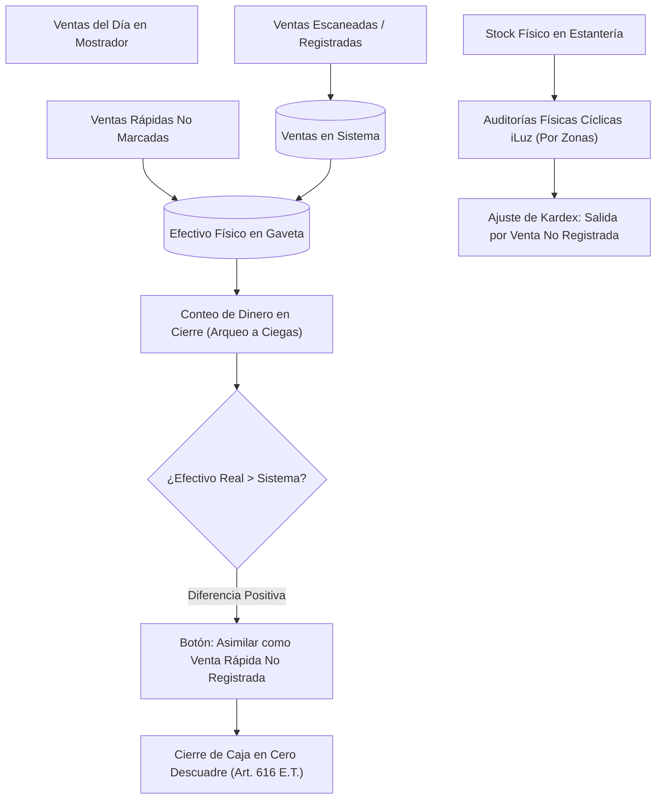

# iLuz - Blueprint & Especificación Técnica: Integración POS & Cumplimiento Legal Colombia (Fase 2)

**Estado del Documento**: Hoja de Ruta / Arquitectura Técnica Oficial  
**Última Actualización**: 2026-09-29  
**Alcance**: Especificación integral para activar el Punto de Venta (POS) en `iLuz` enlazado con el inventario físico, arqueos de caja en mostrador y marco normativo fiscal de Colombia para tiendas de abarrotes (*Persona Natural No Responsable de IVA*).

---

## 1. Marco Legal y Fiscal Aplicable (Colombia)

### 1.1. Régimen Tributario del Negocio
* **Clasificación**: Persona Natural No Responsable del IVA (**Estatuto Tributario Art. 437, Parágrafo 3**).
* **Tope de Ingresos (3.500 UVT)**:
  * Año 2024: `< $164.727.500 COP` (~$13.72M/mes).
  * Año 2025: `< $174.296.500 COP` (~$14.52M/mes).
* **Exoneración de Facturación Electrónica**:
  Bajo el **Art. 616-2 del Estatuto Tributario** y la **Resolución DIAN 000165 de 2023 (Art. 8, Numeral 4)**, el negocio **NO ESTÁ OBLIGADO** a expedir Factura Electrónica de Venta (FEV) ni Documento Equivalente Electrónico POS.

### 1.2. Reglas de Oro de Emisión de Comprobantes
1. **Denominación Obligatoria**:
   El tiquete emitido debe titularse estrictamente como **"Comprobante de Venta Interno"** (o *Tirilla de Control Interno*).
   > **Prohibición Expresa (Arts. 652 y 657 E.T.)**: Jamás imprimir o rotular el tiquete con las palabras *"Factura"*, *"Factura de Venta"* ni *"Documento Equivalente"*.
2. **Leyenda Legal al Pie del Tiquete**:
   ```text
   Documento para Control Interno - Persona Natural No Responsable del IVA 
   (Estatuto Tributario Art. 437 Par. 3). No válido como soporte de costos ni deducciones fiscales.
   ```
3. **Petición de Factura por el Cliente**:
   Si un cliente exige factura para deducir costos en su declaración de renta:
   * La tienda entrega su comprobante interno y copia de RUT/Cédula.
   * La ley (*Res. DIAN 000167 de 2021*) establece que es **el comprador** quien debe emitir en su propio software el **Documento Soporte Electrónico (DSE)** ante la DIAN.

### 1.3. Tratamiento Contable del IVA y Costos (NIIF Grupo 3 - Microempresas)
* **IVA de Compras**: Como la tienda no es responsable de IVA, el impuesto pagado a mayoristas (Bavaria, Postobón, etc.) no es descontable ante la DIAN (**Arts. 488 y 493 E.T.**).
* **Regla de Costo**: Se capitaliza como **mayor valor del costo**:
  $$\text{cost\_price} = \text{Base de Compra} + \text{IVA Pagado al Proveedor}$$
* **IVA de Ventas**: En el mostrador se cobra precio neto final sin desglosar IVA.
* **Impuestos Saludables (Ley 2277/2022)**: El impuesto a ultraprocesados (*ICUI*) y bebidas azucaradas (*IBUA*) lo pagan los fabricantes y ya viene integrado en el costo de adquisición mayorista.

---

## 2. Realidad Operativa del Mostrador: Ventas No Registradas y Arqueo

En una tienda de abarrotes de barrio, durante horas pico o compras menores (menudo/pan/huevos/dulces), se producen **ventas no registradas en el sistema**.
El sistema debe coexistir con esta realidad sin bloquear la operación ni generar frustración:



1. **En la Caja**:
   Al cierre de turno, si el conteo ciego revela más efectivo que las ventas registradas, el sistema ofrece el botón:
   `[Cerrar Turno Asimilando Diferencia como Venta Global No Registrada]`.
   Esto cuadra el dinero al 100% y genera el registro de ingresos conforme al **Libro Fiscal de Operaciones Diarias (Art. 616 E.T.)**.
2. **En el Inventario**:
   Las diferencias físicas acumuladas se concilian periódicamente a través de las **Auditorías por Zonas de iLuz**, generando ajustes justificados que previenen la presunción de ventas omitidas (**Art. 757 E.T.**).

---

## 3. Modelo de Datos para la Integración POS

Se añadirán las siguientes estructuras a SQLite (`db.go`):

```sql
-- 1. Cabecera de Ventas / Comprobantes Internos
CREATE TABLE IF NOT EXISTS sales (
    id             INTEGER PRIMARY KEY AUTOINCREMENT,
    ticket_number  TEXT UNIQUE NOT NULL,      -- Ej: REM-20260929-0001
    total_amount   REAL NOT NULL DEFAULT 0.0,
    payment_method TEXT NOT NULL DEFAULT 'cash' CHECK (payment_method IN ('cash', 'transfer', 'card', 'fiao')),
    amount_paid    REAL NOT NULL DEFAULT 0.0,
    change_due     REAL NOT NULL DEFAULT 0.0,
    customer_name  TEXT NOT NULL DEFAULT 'Cliente de Mostrador',
    notes          TEXT NOT NULL DEFAULT '',
    created_at     DATETIME DEFAULT CURRENT_TIMESTAMP
);

CREATE INDEX IF NOT EXISTS idx_sales_created ON sales(created_at);

-- 2. Detalle de Artículos Vendidos
CREATE TABLE IF NOT EXISTS sale_items (
    id           INTEGER PRIMARY KEY AUTOINCREMENT,
    sale_id      INTEGER NOT NULL REFERENCES sales(id) ON DELETE CASCADE,
    product_id   INTEGER NOT NULL REFERENCES products(id),
    barcode      TEXT NOT NULL,
    product_name TEXT NOT NULL,
    qty          INTEGER NOT NULL CHECK (qty > 0),
    unit_price   REAL NOT NULL,
    cost_price   REAL NOT NULL DEFAULT 0.0,
    subtotal     REAL NOT NULL
);

CREATE INDEX IF NOT EXISTS idx_sale_items_sale ON sale_items(sale_id);
CREATE INDEX IF NOT EXISTS idx_sale_items_product ON sale_items(product_id);

-- 3. Kardex / Libro Unificado de Movimientos de Inventario
CREATE TABLE IF NOT EXISTS stock_movements (
    id          INTEGER PRIMARY KEY AUTOINCREMENT,
    product_id  INTEGER NOT NULL REFERENCES products(id),
    qty         INTEGER NOT NULL, -- Negativo para salidas, positivo para entradas
    reason      TEXT NOT NULL CHECK (reason IN (
                    'sale',                   -- Venta registrada
                    'return',                 -- Devolución de cliente
                    'receipt',                -- Entrada por compra a proveedor
                    'count_adjust',           -- Ajuste por conteo físico en auditoría
                    'unrecorded_sale_adjust', -- Ajuste por faltante de venta no marcada
                    'waste',                  -- Merma operativa perecederos (Art. 64 Num 1)
                    'destruction'             -- Baja por vencimiento con acta (Art. 64 Num 2)
                )),
    source_id   INTEGER,          -- ID de la venta o sesión de auditoría
    notes       TEXT NOT NULL DEFAULT '',
    created_at  DATETIME DEFAULT CURRENT_TIMESTAMP
);

CREATE INDEX IF NOT EXISTS idx_movements_prod_date ON stock_movements(product_id, created_at);

-- 4. Turnos y Arqueos de Caja
CREATE TABLE IF NOT EXISTS cash_shifts (
    id                      INTEGER PRIMARY KEY AUTOINCREMENT,
    opened_at               DATETIME DEFAULT CURRENT_TIMESTAMP,
    closed_at               DATETIME,
    initial_cash            REAL NOT NULL DEFAULT 0.0, -- Base de caja
    expected_cash           REAL NOT NULL DEFAULT 0.0, -- Base + ventas en efectivo
    actual_cash             REAL,                      -- Conteo físico en gaveta
    unrecorded_sales_adjust REAL NOT NULL DEFAULT 0.0, -- Diferencia asimilada
    status                  TEXT NOT NULL DEFAULT 'open' CHECK (status IN ('open', 'closed')),
    notes                   TEXT NOT NULL DEFAULT ''
);

-- 5. Cuentas por Cobrar ("El Fiao")
CREATE TABLE IF NOT EXISTS credit_accounts (
    id            INTEGER PRIMARY KEY AUTOINCREMENT,
    customer_name TEXT NOT NULL UNIQUE,
    phone         TEXT NOT NULL DEFAULT '',
    credit_limit  REAL NOT NULL DEFAULT 50000.0,
    current_debt  REAL NOT NULL DEFAULT 0.0,
    active        INTEGER NOT NULL DEFAULT 1,
    created_at    DATETIME DEFAULT CURRENT_TIMESTAMP
);

CREATE TABLE IF NOT EXISTS credit_payments (
    id          INTEGER PRIMARY KEY AUTOINCREMENT,
    account_id  INTEGER NOT NULL REFERENCES credit_accounts(id),
    amount      REAL NOT NULL CHECK (amount > 0),
    notes       TEXT NOT NULL DEFAULT '',
    created_at  DATETIME DEFAULT CURRENT_TIMESTAMP
);
```

---

## 4. Reconciliación con Auditorías Físicas Abiertas

Para evitar que las ventas en el mostrador causen falsos faltantes durante una toma de inventario abierta, el sistema aplica la fórmula de división temporal:

1. **Ventas antes del conteo físico**:
   $$\text{Movimientos}_{\text{antes}} = \sum \text{qty} \quad (\text{donde } \text{created\_at} \le \text{last\_counted\_at})$$
2. **Ventas después del conteo físico**:
   $$\text{Movimientos}_{\text{después}} = \sum \text{qty} \quad (\text{donde } \text{created\_at} > \text{last\_counted\_at})$$
3. **Cálculo de Variación Real en la Auditoría**:
   $$\text{Stock Esperado al Contar} = \text{system\_stock\_at\_start} + \text{Movimientos}_{\text{antes}}$$
   $$\text{Variación} = \text{counted\_qty} - \text{Stock Esperado al Contar}$$
4. **Stock Real a Escribir al Cerrar Auditoría**:
   $$\text{Stock Final en Base de Datos} = \text{counted\_qty} + \text{Movimientos}_{\text{después}}$$

---

## 5. Módulo de Bajas y Mermas (Art. 64 Estatuto Tributario)

1. **Mermas de Perecederos (Numeral 1)**:
   * Límite legal del **3% sobre (Inventario Inicial + Compras)** para deshidratación, rotura de huevos, empaques averiados y lácteos.
   * No requiere devolver el IVA de compras a la DIAN (**Art. 486 E.T.**).
2. **Bajas por Vencimiento (Numeral 2)**:
   * iLuz auto-genera un PDF descargable: **"Acta de Baja y Destrucción de Inventario"** con fecha, SKU, descripción, costo fiscal unitario, causa ("Vencimiento"), método de descarte y firmas.

---

## 6. Arquitectura Híbrida de Conexión DIAN (Escalabilidad a Futuro)

Si en el futuro el negocio supera las 3.500 UVT o ingresa al Régimen Simple (RST), la aplicación se integrará sin alterar el frontend:

```mermaid
flowchart LR
    subgraph iLuz Desktop POS (Go + SQLite)
        POS["Cajero / Ventas"] --> LocalDB[(SQLite Local)]
        LocalDB --> Printer["Tirilla Interna (Sin DIAN)"]
        LocalDB -.-> Outbox["Cola Asíncrona (dian_outbox)"]
    end
    
    subgraph Módulo Fiscal Opcional
        Outbox -->|Sincronización en segundo plano| ProviderAPI["API REST Externa (Factus / HKA)"]
        ProviderAPI -->|Validación UBL 2.1| DIAN["Servidores DIAN"]
    end
```

* **Fase 1 (Actual)**: Proveedor `NoopDianProvider` (100% offline, costo $0, comprobantes internos).
* **Fase 2 (Formalización)**: Proveedor REST `FactusProvider` que consume API Key sin necesidad de programar SOAP ni comprar certificados digitales propios.
